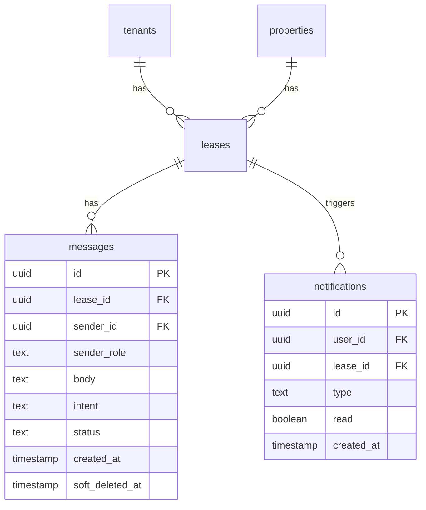

# MVP Messaging System Implementation Plan

## Architecture Overview

This MVP implements a minimal, asynchronous messaging system for tenant-landlord communication tied to leases. The system is intentionally simple—no real-time features, read receipts, or complex interactions—focusing on centralized communication, auditability, and legal safety.

### Core Product Decisions (Non-Negotiable)

- **Single thread per lease**: All communication for a lease happens in one thread
- **Asynchronous by design**: No typing indicators, online presence, or read receipts
- **Immutable messages**: No deletion, only soft-delete for audit trail
- **System messages**: Support for system-generated messages (visually distinct)
- **Intent-based**: Messages have `intent` (general, maintenance, billing, notice) and optional `status` (open, acknowledged, resolved)

### Data Model



**Key Differences from Original Plan:**
- No `message_threads` table - messages reference `lease_id` directly
- `intent` and `status` fields on messages (not threads)
- `sender_role` can be 'system' (in addition to 'tenant'/'landlord')
- `soft_deleted_at` instead of hard delete
- `body` instead of `content`
- No `read_at` field (no read receipts per requirements)

## Implementation Steps

### 1. Database Schema

**File: `supabase/migrations/create_messages_table.sql`**
- Create `messages` table with:
  - `id` (UUID, PK)
  - `lease_id` (UUID, FK → leases.id, CASCADE DELETE)
  - `sender_id` (UUID, FK → users.id, nullable for system messages)
  - `sender_role` (TEXT, CHECK: 'tenant' | 'landlord' | 'system', NOT NULL)
  - `body` (TEXT, NOT NULL)
  - `intent` (TEXT, CHECK: 'general' | 'maintenance' | 'billing' | 'notice', NOT NULL, DEFAULT 'general')
  - `status` (TEXT, CHECK: 'open' | 'acknowledged' | 'resolved', nullable)
  - `created_at` (timestamp, DEFAULT NOW())
  - `soft_deleted_at` (timestamp, nullable)
- Enable RLS
- Add indexes on `lease_id`, `created_at`, `(lease_id, created_at DESC)`, `sender_id`
- Add comment: "Messages are immutable. Use soft_deleted_at for removal, preserve for audit."

**File: `supabase/migrations/create_notifications_table.sql`**
- Create `notifications` table with:
  - `id` (UUID, PK)
  - `user_id` (UUID, FK → users.id, CASCADE DELETE)
  - `lease_id` (UUID, FK → leases.id)
  - `type` (TEXT, CHECK: 'message' | 'system')
  - `read` (BOOLEAN, DEFAULT false)
  - `created_at` (timestamp, DEFAULT NOW())
- Enable RLS
- Add indexes on `user_id`, `(user_id, read)`, `(user_id, read, created_at DESC)`, `lease_id`

### 2. Row Level Security (RLS) Policies

**Access Control Pattern:**
- **Tenants**: Can access messages for leases where `tenant_id` matches their tenant record AND lease is active OR they were a tenant
- **Landlords**: Can access messages for leases where `property.owner_id` matches their user_id
- **After lease end**: Thread becomes read-only (INSERT blocked via RLS for ended leases)
- Both roles can view messages; only active participants can send (enforced via RLS)

**Files:**
- `supabase/migrations/create_messages_rls.sql`
- `supabase/migrations/create_notifications_rls.sql`

**Key Policies:**

**Messages SELECT:**
- Tenants: `lease_id IN (SELECT id FROM leases WHERE tenant_id IN (SELECT id FROM tenants WHERE user_id = auth.uid()))`
- Landlords: `lease_id IN (SELECT id FROM leases WHERE property_id IN (SELECT id FROM properties WHERE owner_id = auth.uid()))`

**Messages INSERT:**
- Tenants: Same as SELECT AND lease is active (lease_end_date IS NULL OR lease_end_date > NOW())
- Landlords: Same as SELECT AND lease is active
- System: Trigger-based (no user policy needed)

**Messages UPDATE:**
- Only `soft_deleted_at` can be updated (soft delete only)
- Users can only soft-delete their own messages (`sender_id = auth.uid()`)

**Messages DELETE:**
- Not allowed (immutable messages)

**Notifications:**
- Users can only view/update their own notifications (`user_id = auth.uid()`)

### 3. Database Triggers & Functions

**File: `supabase/migrations/create_message_triggers.sql`**

- **Notification creation trigger**: On message insert, create notifications for all participants (tenant + landlord) except sender
- **Lease end read-only enforcement**: Function to check if lease is active before INSERT
- **System message helper**: Function to create system messages (sender_id = NULL, sender_role = 'system')

### 4. TypeScript Types

**File: `src/types/database.ts`**
- Add types for `messages` and `notifications` tables
- Extend existing `Database` type:
  ```typescript
  messages: {
    Row: {
      id: string
      lease_id: string
      sender_id: string | null
      sender_role: 'tenant' | 'landlord' | 'system'
      body: string
      intent: 'general' | 'maintenance' | 'billing' | 'notice'
      status: 'open' | 'acknowledged' | 'resolved' | null
      created_at: string
      soft_deleted_at: string | null
    }
    Insert: { ... }
    Update: { soft_deleted_at?: string | null, status?: ... }
  }
  notifications: { ... }
  ```

### 5. React Hooks

**File: `src/hooks/use-lease-messages.ts`**
- `useLeaseMessages(leaseId)` - Fetch all non-deleted messages for a lease, ordered by created_at
- `sendMessage(leaseId, body, intent, status?)` - Insert new message
- `softDeleteMessage(messageId)` - Update message.soft_deleted_at
- `updateMessageStatus(messageId, status)` - Update message.status (for acknowledging/resolving)
- Follows patterns from `src/hooks/use-maintenance-requests.ts`
- **Note**: Currently uses direct Supabase calls (following existing pattern). Designed to work with adapter layer when fully implemented.

**File: `src/hooks/use-notifications.ts`**
- `useNotifications()` - Fetch unread notifications for current user
- `markNotificationAsRead(notificationId)` - Update notification.read = true
- `markAllAsRead()` - Batch update all notifications for user
- `getUnreadCount()` - Return count of unread notifications

**File: `src/hooks/use-lease.ts`** (if needed, or extend use-leases.ts)
- `useLease(leaseId)` - Fetch single lease with property and tenant info
- Used to determine if lease is active (for read-only enforcement)

### 6. UI Components

**File: `src/components/landlord/lease-messages-tab.tsx`**
- Tab content component for lease detail page
- Shows message list (chronologically ordered)
- Message composer at bottom
- Intent selector (general, maintenance, billing, notice)
- System messages visually distinct (different styling, icon)
- Shows "Last message by [name]" and timestamp
- Unread indicator
- Empty state: "No messages yet. Start the conversation..."

**File: `src/components/tenant/lease-messages-tab.tsx`**
- Similar to landlord version
- Entry points: "Message landlord" button, "Report an issue" button (opens composer with intent=maintenance)

**File: `src/components/ui/message-bubble.tsx`**
- Reusable message bubble component
- Handles different roles (tenant/landlord/system)
- Shows timestamp, sender name, intent badge (if not general)
- Status indicator (if status is set)
- Different styling for system messages (subtle background, system icon)

**File: `src/components/ui/message-composer.tsx`**
- Message input component
- Intent selector (dropdown: general, maintenance, billing, notice)
- Optional status selector (for landlords: open, acknowledged, resolved)
- Send button
- Contextual: Pre-fill intent based on entry point

### 7. Lease Detail Page (New)

**File: `src/pages/landlord/lease-detail.tsx`**
- New lease detail page with tabs
- Tabs: "Overview" (lease info), "Messages" (messaging tab)
- Uses shadcn/ui Tabs component (from `docs/ui_conventions.md`)
- Route: `/landlord/properties/:propertyId/leases/:leaseId` or `/landlord/leases/:leaseId`
- Shows lease information, tenant info, property info in Overview tab
- Messages tab uses `LeaseMessagesTab` component

**File: `src/pages/tenant/lease-detail.tsx`**
- Tenant version of lease detail page
- Similar structure, tenant-specific view
- Route: `/tenant/lease/:leaseId` (tenants have one active lease typically)

### 8. Integration Points

**File: `src/components/landlord/lease-summary-card.tsx`**
- Add "View Messages" button/link
- Show unread message indicator (badge) if thread has unread messages
- Link to lease detail page (messages tab)

**File: `src/pages/landlord/property-detail.tsx`**
- Lease cards link to lease detail page (not just show summary)
- Update `LeaseSummaryCard` usage to include navigation

**File: `src/pages/tenant/dashboard.tsx`**
- Add "Message Landlord" button (entry point with intent=general)
- Add "Report an Issue" button (entry point with intent=maintenance)
- Both link to lease detail page (messages tab) with pre-filled intent

**File: `src/pages/tenant/maintenance.tsx`**
- Add "Message Landlord" button (contextual, intent=maintenance)
- Links to lease detail page (messages tab) with intent pre-filled

**File: `src/components/layout/landlord-layout.tsx`**
- Add notification badge to header (shows unread count)
- Link to lease detail pages with unread messages
- Use `useNotifications()` hook

**File: `src/components/layout/tenant-layout.tsx`**
- Add notification badge to header
- Link to lease detail page (messages tab) when clicked

### 9. Router Updates

**File: `src/router/index.tsx`**
- Add `/landlord/leases/:leaseId` route (or `/landlord/properties/:propertyId/leases/:leaseId`)
- Add `/tenant/lease/:leaseId` route (tenants typically have one lease)
- Both routes protected with appropriate role checks

### 10. Documentation

**File: `docs/architecture/messaging.md`** (NEW - Required)
- Purpose of messaging system
- Why single-thread-per-lease (centralization, simplicity, auditability)
- Async design rationale (no real-time overhead, legal safety)
- Audit & legal considerations (immutable messages, soft delete, preservation)
- Diagram showing:
  - Tenant → Message → Lease Thread → Landlord
  - System → Message → Lease Thread → All Participants
- Access control rules
- System message patterns
- Future extensibility notes (but not implementation)

**File: `docs/e2e-testing.md`**
- Update with messaging test scenarios:
  - Tenant sends message
  - Landlord replies
  - System message appears
  - Unread state clears
  - Soft delete works
  - Read-only after lease end

**File: `docs/visual_uat.md`**
- Add messaging visual test scenarios
- Include system message appearance
- Include different intent types
- Include empty state

### 11. Testing Considerations

- **RLS Testing**: Verify tenants can't access other tenants' messages
- **Read-only enforcement**: Verify messages can't be sent after lease ends
- **System messages**: Verify system messages work correctly
- **Soft delete**: Verify messages are hidden but not deleted
- **Notifications**: Verify notifications created for recipients
- **Adapter compatibility**: Design hooks to work with adapter layer (when implemented)
- **Mock data**: Ensure messaging works with `?mock=true` for E2E tests

## Technical Constraints (MVP)

- **No real-time**: Polling or manual refresh acceptable
- **No read receipts**: Removed per requirements
- **No attachments**: Text-only messages (body field)
- **No message editing**: Messages are immutable (only soft delete)
- **No email sending**: Notification records created, email deferred to post-MVP (digestible emails when implemented)
- **Single thread per lease**: No multiple threads/categories per lease
- **No typing indicators**: Async by design
- **No online presence**: Async by design

## Entry Points & UX Flow

1. **Tenant Dashboard**: "Message Landlord" → Opens lease detail (Messages tab) with intent=general
2. **Tenant Dashboard**: "Report an Issue" → Opens lease detail (Messages tab) with intent=maintenance  
3. **Tenant Maintenance Page**: "Message Landlord" → Opens lease detail (Messages tab) with intent=maintenance
4. **Landlord Lease List**: Click lease card → Opens lease detail (Overview tab), can switch to Messages tab
5. **Landlord Lease Card**: "View Messages" button → Opens lease detail (Messages tab)
6. **Notification Badge**: Click → Navigate to relevant lease detail (Messages tab)

**Empty State Handling:**
- Users should never land on empty chat screen
- Show welcome message: "No messages yet. Start the conversation..."
- Composer always visible (unless lease is ended/read-only)

## Post-MVP Enhancement Notes

Document in `docs/architecture/messaging.md`:
- Real-time updates (Supabase Realtime subscriptions)
- Email notifications (digestible format, triggered from notification records)
- File attachments (Supabase Storage integration)
- Message search
- AI summaries/conversation summaries
- Escalation workflows
- Additional intent types
- Message reactions (if needed)
- Typing indicators (if real-time added)

## File Summary

**New Files:**
- `supabase/migrations/create_messages_table.sql`
- `supabase/migrations/create_notifications_table.sql`
- `supabase/migrations/create_messages_rls.sql`
- `supabase/migrations/create_notifications_rls.sql`
- `supabase/migrations/create_message_triggers.sql`
- `src/hooks/use-lease-messages.ts`
- `src/hooks/use-notifications.ts`
- `src/components/ui/message-bubble.tsx`
- `src/components/ui/message-composer.tsx`
- `src/components/landlord/lease-messages-tab.tsx`
- `src/components/tenant/lease-messages-tab.tsx`
- `src/pages/landlord/lease-detail.tsx`
- `src/pages/tenant/lease-detail.tsx`
- `docs/architecture/messaging.md`

**Modified Files:**
- `src/types/database.ts` (add messages and notifications table types)
- `src/router/index.tsx` (add lease detail routes)
- `src/components/landlord/lease-summary-card.tsx` (add messages link, unread indicator)
- `src/pages/landlord/property-detail.tsx` (update lease card navigation)
- `src/pages/tenant/dashboard.tsx` (add entry point buttons)
- `src/pages/tenant/maintenance.tsx` (add entry point button)
- `src/components/layout/landlord-layout.tsx` (add notification badge)
- `src/components/layout/tenant-layout.tsx` (add notification badge)
- `docs/e2e-testing.md` (add messaging test scenarios)
- `docs/visual_uat.md` (add messaging visual tests)

## Key Differences from Original Plan

1. **No thread table**: Messages reference `lease_id` directly (simpler architecture)
2. **Intent on messages**: Each message has intent (not thread category)
3. **System messages**: Explicit support for system-generated messages
4. **Soft delete**: `soft_deleted_at` instead of hard delete
5. **No read receipts**: Removed per requirements
6. **Lease detail page**: Messaging lives as tab on lease detail (not standalone pages)
7. **Documentation required**: New architecture doc with diagrams
8. **Adapter compatibility**: Designed to work with adapter layer (when implemented)

