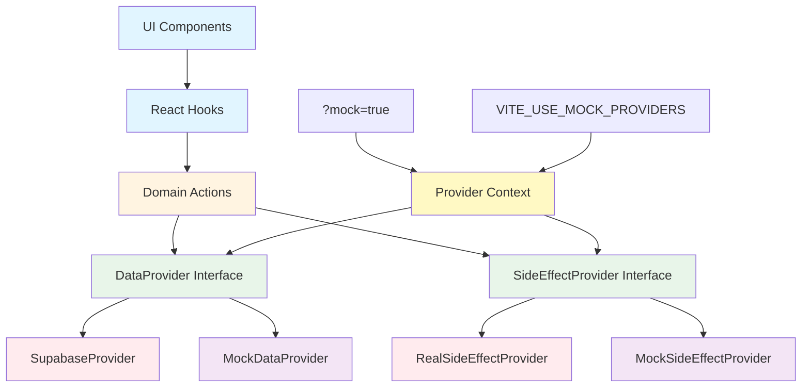

# Adapter Architecture — uhome

## Overview

The adapter/provider architecture is a **product architecture pattern** that enables clean separation between UI, data access, and side effects. This architecture is **not a testing hack**—it is an intentional design that enables mock mode, visual UAT, E2E testing without rate limits, and future integrations with external services.

## Why This Architecture Exists

### The Problem

The uhome app initially used heavy Supabase hook usage throughout the codebase, creating tight coupling between UI components and the database:

- **Direct Supabase calls in hooks**: Every hook directly imports and calls `supabase` client
- **No abstraction layer**: UI components are tightly coupled to Supabase's API
- **Testing challenges**: Visual UAT and E2E tests face significant obstacles:
  - **Rate limits**: Supabase rate limits (30 sign-ups per 5 minutes, 2 emails per hour) break E2E tests
  - **Flaky data**: Real database data changes between test runs, making visual UAT unreliable
  - **Side effects**: Email and notification sending cannot be safely tested
  - **Network dependency**: Tests require live Supabase connection

### The Need for Mock Mode

To enable reliable testing and development, we need:

1. **Deterministic mock data**: Same data on every test run (no randomness, fixed dates)
2. **No Supabase calls in visual UAT**: Visual tests must never hit the database
3. **No side effects in E2E**: Email/notification sending must be recorded, not executed
4. **Fast iteration**: Developers need to work without database dependencies

### Why Not Network Interception?

We explicitly **rejected** Playwright network interception and Supabase client wrapping because:

- **Not explicit**: Network interception is hidden from the codebase—developers can't see it
- **Not enforced**: Nothing prevents direct Supabase calls from bypassing interception
- **Not testable**: Can't verify mock mode is working without running tests
- **Fragile**: Breaks when Supabase API changes or network layer changes
- **Hard to debug**: Mock data lives in test files, not application code

### The Solution: Explicit Adapter Architecture

The adapter architecture makes mock mode **explicit, documented, and enforced**:

- **Explicit**: Mock providers are first-class application code, visible to all developers
- **Enforced**: TypeScript interfaces prevent direct Supabase usage
- **Testable**: Can verify provider selection without running tests
- **Maintainable**: Mock data lives alongside real providers in the codebase
- **Debuggable**: Clear separation makes it easy to understand what's happening

**This is intentional product architecture, not a testing hack.** The same architecture that enables testing also enables:
- Future integrations (Stripe Connect, Plaid, workflow automation)
- Clean separation of concerns
- Easier migration to different data backends
- Better developer experience

## Core Concept: Providers / Adapters

### Architecture Layers

The adapter architecture separates concerns into distinct layers:

```
UI Components
     ↓
   Hooks
     ↓
Domain Logic / Actions
     ↓
┌───────────────────────────┐
│        Adapters           │
│                           │
│  DataProvider             │
│   ├─ SupabaseProvider     │
│   └─ MockDataProvider     │
│                           │
│  SideEffectProvider       │
│   ├─ RealSideEffects      │
│   └─ MockSideEffects      │
└───────────────────────────┘
```

### Layer Responsibilities

1. **UI Components**: React components that render the interface
   - Never directly call Supabase
   - Never directly send emails
   - Use hooks for data and actions

2. **Hooks**: React hooks that manage state and provide data/actions to components
   - Use domain actions (not direct provider calls)
   - Handle loading states, errors, and local state

3. **Domain Logic / Actions**: Business logic functions that orchestrate operations
   - Use providers (not hooks)
   - Handle complex workflows (e.g., create property + assign to groups)
   - Enforce business rules

4. **Adapters / Providers**: Abstraction layer that implements data access and side effects
   - **DataProvider**: Read/write data operations
   - **SideEffectProvider**: Email, notifications, automation

### Provider Types

#### Data Providers

**Purpose**: Handle all data read/write operations.

**Implementations**:
- **SupabaseProvider**: Wraps Supabase client, executes real database operations
- **MockDataProvider**: Returns deterministic mock data from in-memory storage

**Interface Contract**:
- `getProperties()`: Fetch properties
- `createProperty(data)`: Create new property
- `updateProperty(id, data)`: Update property
- `deleteProperty(id)`: Delete property
- Similar methods for all entities (tenants, rent records, expenses, etc.)

#### Side Effect Providers

**Purpose**: Handle all side effects (email, notifications, automation).

**Implementations**:
- **RealSideEffectProvider**: Sends real emails, triggers real notifications
- **MockSideEffectProvider**: Records intents (email queued, notification sent) without executing

**Interface Contract**:
- `sendEmail(to, subject, body)`: Send email (or record intent)
- `sendNotification(userId, message)`: Send notification (or record intent)
- `triggerAutomation(workflow, data)`: Trigger automation (or record intent)

### Key Principles

**UI never talks to Supabase directly**
- All data access goes through `DataProvider` interface
- Components use hooks, hooks use actions, actions use providers

**UI never sends emails directly**
- All side effects go through `SideEffectProvider` interface
- Components call domain actions, actions use side effect providers

**UI calls domain actions → adapters handle execution**
- Components call actions like `createProperty()` or `sendTenantInvite()`
- Actions use appropriate providers based on mode
- Providers execute or mock based on selection

## Architecture Diagram



### Data Flow Example

**Creating a Property (Real Mode)**:
1. User clicks "Create Property" button in UI component
2. Component calls `createProperty()` from `useProperties()` hook
3. Hook calls `propertyActions.create()` domain action
4. Action uses `useDataProvider()` to get current `DataProvider`
5. `DataProvider` is `SupabaseProvider` (real mode)
6. `SupabaseProvider.createProperty()` executes Supabase insert
7. Result flows back: Provider → Action → Hook → Component

**Creating a Property (Mock Mode)**:
1. User clicks "Create Property" button in UI component
2. Component calls `createProperty()` from `useProperties()` hook
3. Hook calls `propertyActions.create()` domain action
4. Action uses `useDataProvider()` to get current `DataProvider`
5. `DataProvider` is `MockDataProvider` (mock mode selected via `?mock=true`)
6. `MockDataProvider.createProperty()` adds to in-memory store
7. Result flows back: Provider → Action → Hook → Component

**The UI code is identical in both modes**—only the provider changes.

## Modes of Operation

The adapter architecture supports multiple modes of operation, each with different provider selections:

| Mode | Data Provider | Side Effect Provider | Purpose |
|------|---------------|---------------------|---------|
| **Local Dev** | Supabase or Mock | Mock | Fast iteration, test without side effects |
| **Visual UAT** | Mock | Mock | UI correctness, deterministic screenshots |
| **CI E2E** | Mock | Mock | Flow correctness, no rate limits |
| **Staging Manual QA** | Real | Real | Human testing with real data |
| **Production** | Real | Real | Real users, real data, real side effects |

### Provider Selection

Providers are selected based on:

1. **URL Parameter**: `?mock=true` enables mock mode
2. **Environment Variable**: `VITE_USE_MOCK_PROVIDERS=true` enables mock mode
3. **Default**: Real providers (Supabase, RealSideEffects) in production

**Selection Logic**:
```typescript
const useMockProviders = 
  urlParams.get('mock') === 'true' || 
  import.meta.env.VITE_USE_MOCK_PROVIDERS === 'true'

const dataProvider = useMockProviders 
  ? new MockDataProvider() 
  : new SupabaseProvider()

const sideEffectProvider = useMockProviders
  ? new MockSideEffectProvider()
  : new RealSideEffectProvider()
```

### Mode-Specific Behavior

#### Local Dev Mode
- **Data**: Developer chooses (Supabase for real data, Mock for fast iteration)
- **Side Effects**: Always Mock (no emails sent during development)
- **Use Case**: Daily development work

#### Visual UAT Mode
- **Data**: Always Mock (deterministic, no database dependency)
- **Side Effects**: Always Mock (no side effects triggered)
- **Use Case**: Automated visual regression testing
- **Requirement**: Adapter layer is a **hard dependency**—visual tests cannot run without it

#### CI E2E Mode
- **Data**: Always Mock (no rate limits, deterministic)
- **Side Effects**: Always Mock (record intents, don't execute)
- **Use Case**: Automated end-to-end flow testing
- **Benefit**: Tests assert "email intent recorded" not "email delivered"

#### Staging Manual QA Mode
- **Data**: Real (Supabase staging database)
- **Side Effects**: Real (actual emails, notifications)
- **Use Case**: Human QA testing before production

#### Production Mode
- **Data**: Real (Supabase production database)
- **Side Effects**: Real (actual emails, notifications, automation)
- **Use Case**: Real users, real operations

## What This Enables

### Explicit Benefits

1. **Visual UAT without flaky data**
   - Deterministic mock data produces identical screenshots every run
   - No database dependency means tests run faster and more reliably
   - Visual correctness becomes a pass/fail condition

2. **E2E without email/SMS rate limits**
   - Mock side effect provider records intents without executing
   - Tests assert "email queued" not "email delivered"
   - No rate limit errors, no account restrictions

3. **Safe simulation of automation**
   - Mock providers can simulate workflow automation
   - Test automation logic without triggering real side effects
   - Verify automation intent without execution

4. **Ability to assert intent instead of side effects**
   - Tests verify business logic, not external service delivery
   - Faster tests (no waiting for email delivery)
   - More reliable tests (no external service failures)

5. **Cleaner future integrations**
   - Stripe Connect: Payment provider abstraction
   - Plaid: Banking provider abstraction
   - Workflow automation: Automation provider abstraction
   - All follow the same adapter pattern

6. **Data consistency verification**
   - Data persistence tests verify mock provider returns consistent data
   - Tests ensure relationships are maintained across components (property → tenant → rent records)
   - Tests verify filters work correctly with mock data
   - Tests verify charts calculate from same data source as ledger
   - Enables confidence that mock mode accurately represents real data relationships

6. **Data consistency across components**
   - Mock provider returns consistent data across all components
   - Tests verify property names, tenant emails, and amounts match across ledger, properties, tenants, and finances pages
   - Tests ensure charts calculate from the same data source as the ledger
   - Tests verify filters affect both charts and ledger consistently
   - Tests verify graph type changes show the same underlying data
   - Tests verify time range aggregation works correctly across all views

### Long-Term Benefits

- **Easier backend migration**: Change data provider without touching UI code
- **Better testability**: Every feature can be tested in isolation
- **Clearer architecture**: Separation of concerns is explicit
- **Developer experience**: Fast iteration with mock mode
- **Production safety**: Real providers only in production

## Build Plan

This section outlines the implementation sequence for the adapter architecture. The plan is **sequenced and realistic**, not aspirational.

### Phase 1: Foundation

#### 1.1 Introduce Provider Interfaces

**File**: `src/lib/providers/types.ts`

Define TypeScript interfaces for all providers:

```typescript
// Data Provider Interface
interface DataProvider {
  // Properties
  getProperties(): Promise<Property[]>
  createProperty(data: PropertyInsert): Promise<Property>
  updateProperty(id: string, data: PropertyUpdate): Promise<Property>
  deleteProperty(id: string): Promise<void>
  
  // Tenants
  getTenants(): Promise<Tenant[]>
  createTenant(data: TenantInsert): Promise<Tenant>
  // ... etc for all entities
}

// Side Effect Provider Interface
interface SideEffectProvider {
  sendEmail(to: string, subject: string, body: string): Promise<{ queued: boolean }>
  sendNotification(userId: string, message: string): Promise<{ queued: boolean }>
  triggerAutomation(workflow: string, data: any): Promise<{ queued: boolean }>
}
```

**Deliverable**: Clear contracts for each provider type.

#### 1.2 Create Provider Context/Selection

**File**: `src/lib/providers/context.tsx`

Create React context that:
- Reads `?mock=true` from URL params
- Reads `VITE_USE_MOCK_PROVIDERS` from env vars
- Provides selected providers via context
- Exports hooks: `useDataProvider()`, `useSideEffectProvider()`

**Deliverable**: Provider selection logic and React context.

### Phase 2: Mock Providers

#### 2.1 Implement MockDataProvider

**File**: `src/lib/providers/mock-data-provider.ts`

- Deterministic mock data (no randomness, fixed dates)
- In-memory storage (Map/object-based, no Supabase)
- Implements `DataProvider` interface
- Returns same data on every call (deterministic)

**Deliverable**: Mock data provider with deterministic data.

#### 2.2 Implement MockSideEffectProvider

**File**: `src/lib/providers/mock-side-effect-provider.ts`

- Records intents in memory (email queued, notification sent)
- No actual side effects (no emails sent, no notifications delivered)
- Implements `SideEffectProvider` interface
- Provides access to recorded intents for test assertions

**Deliverable**: Mock side effect provider that records intents.

### Phase 3: Real Providers

#### 3.1 Implement SupabaseProvider

**File**: `src/lib/providers/supabase-provider.ts`

- Wraps existing Supabase client
- Implements `DataProvider` interface
- Migrates existing Supabase calls to provider methods
- No changes to Supabase client usage, just wrapped

**Deliverable**: Real Supabase data provider.

#### 3.2 Implement RealSideEffectProvider

**File**: `src/lib/providers/real-side-effect-provider.ts`

- Handles real email/notification sending (future implementation)
- Implements `SideEffectProvider` interface
- Placeholder for now (no real side effects in MVP)
- Will integrate with email service (SendGrid, Resend, etc.) in future

**Deliverable**: Real side effect provider (placeholder for future).

### Phase 4: Migration

#### 4.1 Wire Provider Selection via `?mock=true`

**File**: `src/lib/url-params.ts`

- Add `isMockMode()` function that checks URL params
- Update provider context to use this function
- Add env var fallback: `VITE_USE_MOCK_PROVIDERS`

**Deliverable**: Mock mode detection and provider selection.

#### 4.2 Migrate Read-Heavy Hooks First

**Files**: `src/hooks/use-properties.ts`, `src/hooks/use-tenants.ts`, `src/hooks/use-rent-records.ts`

- Replace direct `supabase` imports with `useDataProvider()`
- Update hook methods to use provider interface
- Test both mock and real modes
- Verify UI works identically in both modes

**Deliverable**: First set of hooks migrated to use providers.

#### 4.3 Create Domain Actions Layer

**Files**: `src/lib/actions/property-actions.ts`, `src/lib/actions/tenant-actions.ts`, etc.

- Extract business logic from hooks into actions
- Actions use providers (not hooks)
- Hooks call actions, actions use providers
- Example: `createProperty()` action handles property creation + group assignment

**Deliverable**: Domain actions layer with business logic.

### Phase 5: Testing Integration

#### 5.1 Enable Visual UAT to Use Mock Mode

**Files**: `tests/visual/**/*.spec.ts`, `tests/visual/helpers/visual-helpers.ts`

- Remove Playwright network interception (`tests/visual/helpers/mock-supabase.ts`)
- Visual tests use `?mock=true` to enable mock providers
- Verify deterministic screenshots
- Update visual test helpers to set mock mode

**Deliverable**: Visual UAT uses application-level mock providers.

#### 5.2 Add E2E Support Without Side Effects

**Files**: `tests/**/*.spec.ts`, `tests/helpers/**/*.ts`

- E2E tests use mock providers by default
- Assert side effect intents (not actual sends)
- Remove rate limit concerns
- Update test helpers to enable mock mode

**Deliverable**: E2E tests use mock providers, no rate limits.

### Phase 6: Cleanup

#### 6.1 Remove Direct Supabase Imports

**Files**: All files in `src/hooks/`

- Audit all hooks for direct `supabase` imports
- Migrate remaining hooks to use providers
- Remove unused Supabase client imports
- Verify no direct Supabase usage remains

**Deliverable**: All hooks use providers, no direct Supabase calls.

#### 6.2 Remove Network Interception

**File**: `tests/visual/helpers/mock-supabase.ts`

- Delete file (no longer needed)
- Update visual test documentation
- Verify all visual tests use mock providers

**Deliverable**: Network interception removed, application-level providers used.

## Implementation Notes

### Migration Strategy

1. **Start with read operations**: Easier to migrate, less risk
2. **Test both modes**: Verify mock and real modes work identically
3. **Migrate incrementally**: One hook at a time, verify after each
4. **Keep old code until migration complete**: Don't delete until fully migrated

### Testing Strategy

1. **Unit tests for providers**: Test each provider in isolation
2. **Integration tests for actions**: Test actions with both mock and real providers
3. **Visual UAT with mock**: Verify deterministic screenshots
4. **E2E with mock**: Verify flows work without rate limits

### Rollout Plan

1. **Phase 1-3**: Foundation and providers (no UI changes)
2. **Phase 4**: Migrate hooks incrementally (UI works in both modes)
3. **Phase 5**: Update tests to use mock providers
4. **Phase 6**: Cleanup and remove old code

## Success Criteria

The adapter architecture is successful when:

- ✅ Any contributor can read this doc and understand why adapters exist
- ✅ Visual UAT uses mock providers (no Supabase calls)
- ✅ E2E tests use mock providers (no rate limits)
- ✅ UI code is identical in mock and real modes
- ✅ Provider selection is explicit and documented
- ✅ All hooks use providers (no direct Supabase calls)
- ✅ Architecture diagram clearly shows data flow
- ✅ All modes of operation are documented and working

## Related Documentation

- [Visual UAT Guide](visual_uat.md) - Visual testing with mock providers
- [E2E Testing Guide](e2e-testing.md) - E2E testing strategy with mock providers
- [Mock Mode Philosophy](mock_mode_philosophy.md) - Philosophy behind mock data

