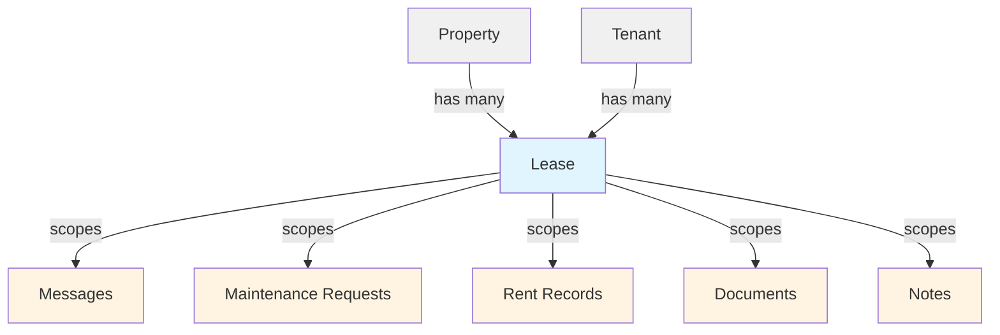

# Lease Model Architecture

## Overview

Leases are **first-class entities** in uhome. They are not owned by properties or embedded in tenants—they are standalone entities that connect properties (or units) and tenants.

## Data Model

### Canonical Relationship

```
Property ──┐
           ├── Lease ─── Tenant(s)
Unit  ─────┘
```

### Key Principles

1. **Leases are standalone** - They exist independently and reference both properties and tenants
2. **Properties can exist without leases** - A property can have zero active leases
3. **Tenants can exist without leases** - A tenant record can exist before being added to a lease
4. **A lease MUST reference:**
   - Exactly one property (or unit, when units are implemented)
   - One or more tenants (currently one, but designed for future multi-tenant support)

## Lease-Scoped Entities

All lease-scoped entities attach to `lease_id`, not `property_id` or `tenant_id`:

- ✅ **Messages** - All messaging is lease-scoped (one thread per lease)
- ✅ **Maintenance Requests** - Maintenance is tied to a specific lease
- ✅ **Rent Records** - Rent payments are tracked per lease
- ✅ **Documents** - Documents can be lease-scoped (or property-scoped for general docs)
- ✅ **Notes** - Notes can attach to leases via `entity_type='lease'`

## Database Schema

### Leases Table

```sql
CREATE TABLE public.leases (
  id UUID PRIMARY KEY,
  property_id UUID NOT NULL REFERENCES properties(id),
  tenant_id UUID NOT NULL REFERENCES tenants(id),
  lease_start_date DATE NOT NULL,
  lease_end_date DATE NULL,
  lease_type TEXT CHECK (lease_type IN ('short-term', 'long-term')),
  rent_amount NUMERIC(10, 2) NOT NULL,
  rent_frequency TEXT CHECK (rent_frequency IN ('monthly', 'weekly', 'biweekly', 'yearly')),
  security_deposit NUMERIC(10, 2) NULL,
  created_at TIMESTAMP WITH TIME ZONE,
  updated_at TIMESTAMP WITH TIME ZONE
);
```

### Lease-Scoped Tables

All lease-scoped tables include `lease_id`:

- `messages.lease_id`
- `maintenance_requests.lease_id`
- `rent_records.lease_id`
- `documents.lease_id` (optional, can also be property-scoped)

## Access Control

### Row Level Security (RLS)

**Tenants** can:
- View leases where `tenant_id` matches their tenant record
- Access all lease-scoped data for their leases

**Landlords** can:
- View leases for properties they own
- Access all lease-scoped data for their property leases
- Manage leases (create, update, delete)

**RLS Policies** ensure:
- Tenants only see their own lease data
- Landlords only see data for leases on their properties
- All lease-scoped entities inherit these access rules

## Lease ≠ Property Membership

**Critical distinction:**

- **Adding a tenant to a lease** grants access to:
  - Messages for that lease
  - Maintenance requests for that lease
  - Rent visibility for that lease
  - Documents for that lease
  - Represents a household/contract
  - Is time-bound (start and end dates)

- **Property access** remains landlord-only
  - Property management
  - Property settings
  - Property-level documents (optional)

This distinction ensures:
- Clear separation between lease contracts and property ownership
- Time-bound access that ends with the lease
- Ability to have multiple leases per property over time
- Future support for multi-tenant leases (roommates, co-signers)

## Implementation Notes

### Backward Compatibility

During migration:
- `property_id` and `tenant_id` fields remain nullable in lease-scoped tables
- RLS policies support both old and new query patterns
- Application code gradually migrates to use `lease_id` only

### Query Patterns

**Preferred (lease-scoped):**
```typescript
// Query messages by lease
const messages = await supabase
  .from('messages')
  .select('*')
  .eq('lease_id', leaseId)
```

**Legacy (backward compatibility):**
```typescript
// Query by property_id (for migration period only)
const requests = await supabase
  .from('maintenance_requests')
  .select('*')
  .eq('property_id', propertyId)
```

## Future Extensibility

### Multi-Tenant Leases

The schema supports future multi-tenant leases:
- Current: `tenant_id` (singular)
- Future: `lease_tenants` junction table for roommates/co-signers

### Unit Support

Future enhancement for units:
- `leases.unit_id` (optional, currently uses `property_id`)
- Allows same property to have multiple leases via units

### Lease History

Multiple leases per property are supported:
- Each lease has `lease_start_date` and `lease_end_date`
- Property can have multiple historical leases
- Current lease is determined by date ranges

## Visual Model



## Related Documentation

- [Messaging Architecture](./messaging.md) - Lease-scoped messaging system
- [Supabase Schema](../supabase_schema.md) - Full database schema
- [Migration Guide](../../supabase/migrations/README.md) - Lease normalization migrations

