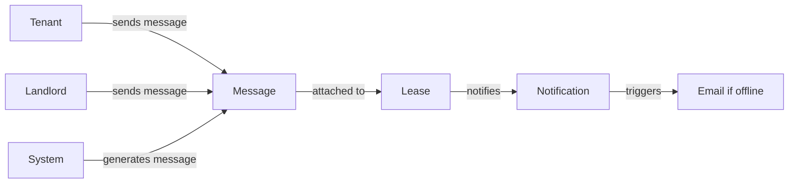

# Messaging System Architecture

## Overview

The uhome messaging system is a lease-scoped, asynchronous communication platform designed for tenant-landlord communication. It prioritizes clarity, auditability, and simplicity over real-time features.

## Core Principles

### 1. Single Thread Per Lease

- **One conversation thread per lease**
- All active tenants and landlords on a lease participate in the same thread
- No multiple threads per lease in MVP
- Thread context is always clear (tied to specific lease)

### 2. Asynchronous by Design

- No typing indicators
- No online presence
- No read receipts (beyond basic read tracking)
- Delayed replies are acceptable and expected
- Designed for async communication, not instant messaging

### 3. Immutability & Auditability

- Messages are **immutable** - no permanent deletion
- Soft-delete only (sets `soft_deleted_at` timestamp)
- All messages preserved for legal and audit purposes
- System-generated messages are visually distinct

## Message Structure

### Required Fields

```typescript
{
  id: string
  lease_id: string              // Lease-scoped (required)
  sender_id: string             // User who sent (nullable for system messages)
  sender_role: 'tenant' | 'landlord' | 'system'
  body: string                  // Message content
  intent: 'general' | 'maintenance' | 'billing' | 'notice'
  status: 'open' | 'acknowledged' | 'resolved' | null
  created_at: string
  soft_deleted_at: string | null
}
```

### Message Intent

Messages are categorized by intent:
- **general** - General communication
- **maintenance** - Maintenance-related messages
- **billing** - Rent, payments, financial matters
- **notice** - Official notices, system messages

### Message Status

Optional status tracking (primarily for landlords):
- **open** - Issue reported, not yet addressed
- **acknowledged** - Landlord has seen and acknowledged
- **resolved** - Issue resolved or completed

## Unified Messages UI

### Entry Point

**Single global Messages page** accessible from:
- Main navigation header (tenant and landlord)
- Route: `/tenant/messages` or `/landlord/messages`

### Tenant View

- Shows list of active leases
- Each lease card displays:
  - Property name
  - Lease dates
  - Last message preview
  - Unread message indicator
  - Timestamp of last message
- Clicking a lease opens the thread view
- Empty state: "Messaging starts once your landlord adds you to a lease."

### Landlord View

- Shows all active leases
- Grouped by property
- Sorted by most recent message activity
- Each lease card displays:
  - Tenant name/email
  - Property name
  - Last message preview
  - Unread message indicator
  - Timestamp of last message
- Clicking a lease opens the thread view
- Empty state: "Messages appear here once you have active leases."

## Thread Scoping Rules

### Access Control

- **All active tenants** on a lease can view and send messages
- **Landlords** can view and reply
- **After lease end** - Thread becomes read-only (no new messages)
- **System messages** - Generated automatically for lease events

### Entry Points

**Primary:**
- Global "Messages" nav item → `/messages` page

**Contextual (deep-link):**
- "Report an issue" → Opens Messages with `intent=maintenance`
- "Message landlord" → Opens Messages with `intent=general`
- Lease detail pages → Can link to Messages (secondary entry point)

**Removed:**
- Scattered "Message Landlord" buttons across pages (replaced with Messages nav link)

## Data Flow

### Message Creation



### Message Flow

1. User composes message with intent
2. Message saved to `messages` table with `lease_id`
3. Trigger creates notification for recipient
4. Recipient sees unread indicator in Messages nav
5. Email notification sent if user is offline (future)

## Notifications

### In-App Notifications

- Created automatically when message is sent
- Stored in `notifications` table
- Linked to `lease_id` and `message_id`
- Unread count displayed in Messages nav badge
- Marked as read when Messages page is viewed

### Email Notifications (Future)

- Only sent if user is offline
- Digestible format (not one email per message)
- System messages do not overwhelm human messages

## Database Schema

### Messages Table

```sql
CREATE TABLE public.messages (
  id UUID PRIMARY KEY,
  lease_id UUID NOT NULL REFERENCES leases(id),
  sender_id UUID REFERENCES users(id),
  sender_role TEXT CHECK (sender_role IN ('tenant', 'landlord', 'system')),
  body TEXT NOT NULL,
  intent TEXT CHECK (intent IN ('general', 'maintenance', 'billing', 'notice')),
  status TEXT CHECK (status IN ('open', 'acknowledged', 'resolved')),
  created_at TIMESTAMP WITH TIME ZONE,
  soft_deleted_at TIMESTAMP WITH TIME ZONE NULL
);
```

### Notifications Table

```sql
CREATE TABLE public.notifications (
  id UUID PRIMARY KEY,
  user_id UUID NOT NULL REFERENCES users(id),
  lease_id UUID NOT NULL REFERENCES leases(id),
  message_id UUID REFERENCES messages(id),
  type TEXT CHECK (type IN ('message', 'system')),
  read BOOLEAN NOT NULL DEFAULT false,
  created_at TIMESTAMP WITH TIME ZONE
);
```

## Component Architecture

### Unified Messages Page

**Files:**
- `src/pages/tenant/messages.tsx` - Tenant Messages page
- `src/pages/landlord/messages.tsx` - Landlord Messages page

**Features:**
- Lease list view (tenant) or grouped by property (landlord)
- Thread detail view when lease selected
- Unread indicators
- Last message previews

### Lease Thread Component

**File:** `src/components/messages/lease-thread.tsx`

**Features:**
- Reusable component for displaying lease-scoped message thread
- Accepts `leaseId` prop
- Shows message list, composer (if lease active), empty states
- Handles read-only state when lease ends

### Hooks

**File:** `src/hooks/use-lease-messages.ts`

**Features:**
- Fetch messages by `lease_id`
- Send messages
- Soft-delete messages
- Mark messages as read

**File:** `src/hooks/use-notifications.ts`

**Features:**
- Fetch unread notifications
- Mark notifications as read
- Unread count for UI badges

## UX Behavior

### Empty States

All empty states use clear, human language:

- **No lease:** "You'll be able to message once your landlord adds you to a lease."
- **No messages:** "Start the conversation with your landlord."
- **Lease ended:** "This lease has ended. This conversation is now read-only."

### Read-Only After Lease End

When `lease_end_date` has passed:
- Composer is disabled
- Message: "This lease has ended. This conversation is now read-only."
- All messages remain visible for history/audit

### Contextual Entry Points

Deep-linking with query parameters:
- `/tenant/messages?intent=maintenance` - Opens with maintenance intent pre-selected
- `/tenant/messages/:leaseId?intent=general` - Opens specific lease thread with intent

## Out of Scope (MVP)

The following are explicitly **not** included in MVP:

- Multiple threads per lease
- Typing indicators
- Online presence/status
- Message reactions
- Attachments beyond basic images (future)
- SLA or response-time guarantees
- Real-time push notifications (polling/refresh acceptable)

## Future Extensibility

### Planned Enhancements

- **Multi-tenant leases** - Support roommates/co-signers in same thread
- **Message attachments** - Images and files
- **Email digests** - Daily/weekly summaries
- **Message search** - Full-text search within lease threads
- **AI summaries** - Automatic summaries of long threads

### Not Planned

- Real-time messaging (stays async)
- Read receipts (stays minimal)
- Multiple threads per lease (keeps clarity)
- Direct messages outside leases (always lease-scoped)

## Related Documentation

- [Lease Model](./lease-model.md) - Lease as first-class entity
- [Migration Guide](../../supabase/migrations/MESSAGING_MIGRATION.md) - Database setup
- [Quick Start Guide](../MESSAGING_QUICK_START.md) - User-facing guide

