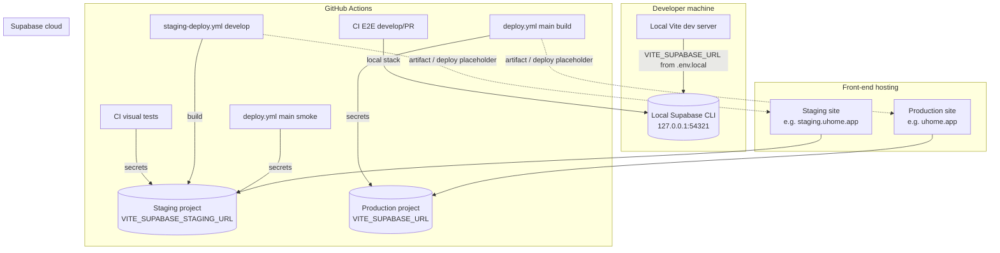

# Environment → Supabase mapping (uhome / haume)

This document describes how runtime and CI environments connect to Supabase. **Actual project URLs and keys are not committed**; they live in `.env.local`, GitHub Actions secrets, and hosting provider env vars.

## 1. Supabase-related environment variables (URLs)

| Variable | Where set | Role |
|----------|-----------|------|
| `VITE_SUPABASE_URL` | Local `.env.local`, Vercel/Netlify, GitHub Actions `env` on build | **Primary** browser/API URL embedded in the client bundle |
| `VITE_SUPABASE_ANON_KEY` | Same as above | Public anon key paired with `VITE_SUPABASE_URL` |
| `VITE_SUPABASE_STAGING_URL` | GitHub secrets | Staging project URL for CI (E2E, visual tests, pre-deploy smoke) |
| `VITE_SUPABASE_STAGING_ANON_KEY` | GitHub secrets | Staging anon key for CI |
| `VITE_SUPABASE_URL` (CI build fallback) | `ci.yml` lint/build | Uses `secrets.VITE_SUPABASE_URL` or `secrets.VITE_SUPABASE_STAGING_URL` or placeholder |
| `SUPABASE_URL` | Supabase Edge Functions (platform-injected) | Server-side project URL in Deno functions |
| `SUPABASE_CLOUD_URL` / `VITE_SUPABASE_URL_PROD` / `PROD_SUPABASE_URL` | Local scripts (`.env.local`) | Parity / schema verification scripts comparing staging vs production |
| Local CLI | `http://127.0.0.1:54321` (default Supabase API) | From `supabase start`; `scripts/get-local-supabase-env.ts` prints `VITE_SUPABASE_URL` |

## 2. Which environment uses which Supabase project

| Logical environment | Typical `VITE_SUPABASE_URL` source | Supabase project (dashboard) |
|---------------------|------------------------------------|------------------------------|
| **Local** | `.env.local` or CLI output (`npx supabase status`) | **Local** Supabase (Docker via Supabase CLI) — not a cloud project |
| **Staging** | Vercel **Preview** env for `develop`, or `VITE_SUPABASE_STAGING_*` in GitHub Actions | **uhome staging** (staging cloud project) |
| **Production** | Vercel **Production** env for `main`, or `secrets.VITE_SUPABASE_URL` on `main` deploy | **uhome-app** (production cloud project) |

**Domains / branches:** Vercel Preview deploys from `develop` → staging Supabase stack; Vercel Production from `main` → uhome-app. Example hostnames: preview URLs or `staging.uhome.app` for staging; `uhome.app` for production.

### Vercel environment variables (checklist)

Values are embedded at **build** time (`VITE_*`). Use the **staging** project for Preview, **uhome-app** for Production.

| Variable | Vercel Preview (`develop`) | Vercel Production (`main`) |
|----------|----------------------------|----------------------------|
| `VITE_SUPABASE_URL` | uhome staging URL | uhome-app URL |
| `VITE_SUPABASE_ANON_KEY` | uhome staging anon key | uhome-app anon key |
| `VITE_ENVIRONMENT` | `staging` | `production` |
| `VITE_SUPABASE_ENV` | `staging` (optional legacy) | `production` (optional) |
| `VITE_HOSTING_ENV` | `preview` (optional; `VERCEL_ENV` is usually enough) | `production` |
| `VITE_STAGING_SUPABASE_PROJECT_REF` | optional | **Set** to staging project ref (subdomain only) — `src/app-startup.ts` blocks production hosting from using the staging URL |

Do **not** set `SUPABASE_SERVICE_ROLE_KEY` on the Vercel frontend project; service role stays in Supabase Edge Function secrets and local `.env.local` for scripts.

## 3. Git branch / workflow → Supabase

In this repo the **staging** line is the branch `develop` (not `development`). Vercel Preview should track that branch for the uhome staging stack.

| Git branch / workflow | Workflow file | `VITE_SUPABASE_URL` at build / test |
|----------------------|---------------|-------------------------------------|
| `develop`, PRs | `ci.yml` — local E2E | Local Supabase (`supabase start`) |
| `develop`, PRs | `ci.yml` — visual tests | `secrets.VITE_SUPABASE_STAGING_URL` |
| `develop` | `staging-deploy.yml` | `secrets.VITE_SUPABASE_STAGING_URL` |
| `main` | `deploy.yml` — pre-deploy E2E | `secrets.VITE_SUPABASE_STAGING_URL` |
| `main` | `deploy.yml` — production build | `secrets.VITE_SUPABASE_URL` |

Pre-deploy E2E on `main` **intentionally** hits **staging** Supabase to validate before a production build.

## 4. Startup logging and production safeguards (implemented)

- **Startup logs** (`src/app-startup.ts`, imported from `src/main.tsx`): environment name, full `VITE_SUPABASE_URL`, hosting label, and **production vs preview** (from `VITE_HOSTING_ENV` / `VERCEL_ENV` via `vite.config.ts`).
- **GitHub production build** (`.github/workflows/deploy.yml`): fails if `VITE_SUPABASE_URL` equals `VITE_SUPABASE_STAGING_URL`; derives staging project ref and sets `VITE_STAGING_SUPABASE_PROJECT_REF` so the **browser** throws if production hosting is pointed at the staging project URL.
- **Vercel-only production**: set `VITE_STAGING_SUPABASE_PROJECT_REF` to the **staging** project ref (subdomain of `https://<ref>.supabase.co`) on the **production** project so the same runtime check applies, or rely on never copying staging URL into production env (CI still recommended).

## 5. Environment architecture

## 6. Mapping table (fill in real URLs in your runbooks; secrets stay in Vercel/GitHub)

| Environment | Domain (example) | Git branch | Supabase project |
|-------------|------------------|------------|------------------|
| Local | `localhost:3000` (Vite; app may use port 1000 per `package.json`) | any | Local CLI — `project_id` in `supabase/config.toml` is **not** the cloud ref |
| CI E2E | N/A (Playwright in Actions) | `develop` / PR | Local (ephemeral) |
| CI visual | N/A | `main` / `develop` | uhome staging (GitHub secret) |
| Staging | Vercel Preview URL or `staging.uhome.app` | `develop` | uhome staging |
| Production | `uhome.app` | `main` | uhome-app |

## 7. Known in-repo references (not secrets)

- Internal docs and reports sometimes mention a specific `*.supabase.co` host as an example; **treat the dashboard + secrets as source of truth** for the live project mapping.

## 8. Schema changes and seeds

For migrations, `seed.sql`, and how local / **uhome-staging** / **uhome-app** stay in sync, see **[database-migrations.md](./database-migrations.md)**.
