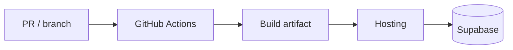

# Deployment pipeline

> **Summary for AI / planning.** Workflow files and hosting docs are canonical.

## Workflows (CI/CD)

| Workflow | File | Role |
|----------|------|------|
| CI (lint, build, E2E, visual) | [.github/workflows/ci.yml](../.github/workflows/ci.yml) | |
| Deploy / production path | [.github/workflows/deploy.yml](../.github/workflows/deploy.yml) | Confirm name if additional workflows exist |

- **Narrative:** [docs/ci_cd.md](../docs/ci_cd.md)
- **Release process:** [docs/release-process.md](../docs/release-process.md)
- **Deployment (hosting):** [docs/deployment.md](../docs/deployment.md)

## Environments

| Environment | Typical use | Supabase project (names) |
|-------------|-------------|----------------------------|
| Local | Dev, E2E | Docker via Supabase CLI |
| Staging | QA, previews | `uhome-staging` (see [docs/environment-mapping.md](../docs/environment-mapping.md)) |
| Production | Live | `uhome-app` |

## Frontend hosting

<!-- e.g. Vercel: branch → env → build args. -->

- **Env mapping for URLs and secrets:** [docs/environment-mapping.md](../docs/environment-mapping.md)

## Database and schema promotion

- **Migrations / push / safety:** [docs/database-migrations.md](../docs/database-migrations.md)

## Smoke / launch gates

- [docs/smoke-tests.md](../docs/smoke-tests.md)
- [docs/pre-launch-checklist.md](../docs/pre-launch-checklist.md)
- [docs/production-checklist.md](../docs/production-checklist.md)

## Monitoring (post-deploy)

- [docs/monitoring.md](../docs/monitoring.md)

## Diagram (optional)

## Open questions

<!-- CDN, preview DB isolation, Edge Function deploy path, etc. -->
